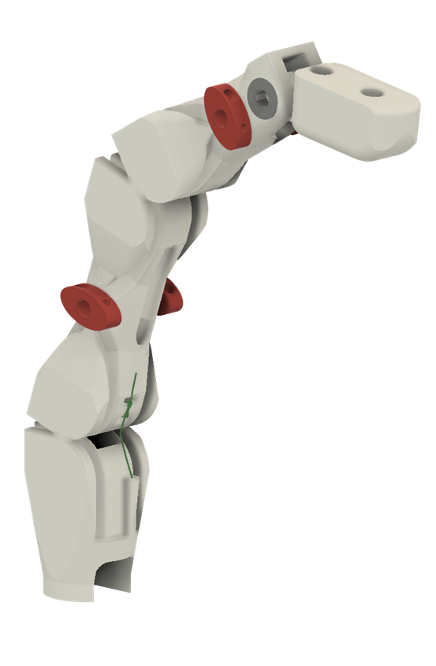
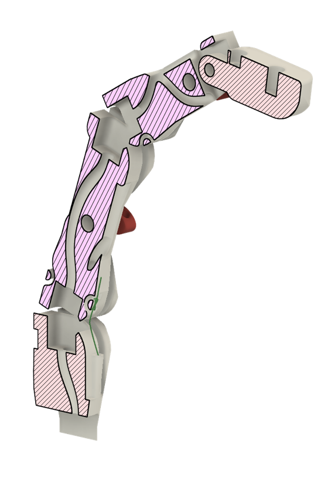

## Project Overview

During the first edition of the Real World Robotics class we were tasked with desigining, manufacturing, building and programming a dextrous robotic manipulator - all from scratch (well, mostly). Teams of 4-5 people worked to solve teleoperation and reinforcement learning tasks for a semester. It was an ambitious challenge, but it let me train some muscles I hadn't in a bit: CAD design, manufacturing, and simple Blender animations. Take a look at this video featured on the Soft Robotics Lab youtube channel.

  <iframe style="position: absolute; top: 0; left: 0; width: 100%; height: 100%;" src="https://www.youtube.com/embed/CCer3cUU1JQ" frameborder="0" allow="accelerometer; autoplay; clipboard-write; encrypted-media; gyroscope; picture-in-picture" allowfullscreen></iframe>

## Hand design

  

    

      
      

        
      

      

      
    

    

      
⇕

    

  

I really like the finished look of the robot hand. But not only does it look pretty, it's also pretty functional. Take a look at the finger, for instance. The workhorse joints are rolling contact, minimizing friction. The red nubs are ligament tighteners, which make for a dead simple manufacturing process. And the sleek outside hides a complex internal routing of tendons. See for yourself - you can drag the slider down and reveal a cross-section. The finger design is the same across the hand, even the thumb. As a result it looks somewhat freakishly long, but it really helped in some of the teleoperation tasks.

## Control

This is the not-from-scratch part. We had Oak-D depth cameras with a hand pose reconstruction pipeline running on them, which we used to retarget someone's hand motion directly to the robot hand. It's a surreal feeling to see a robot hand copying your movements. 

 